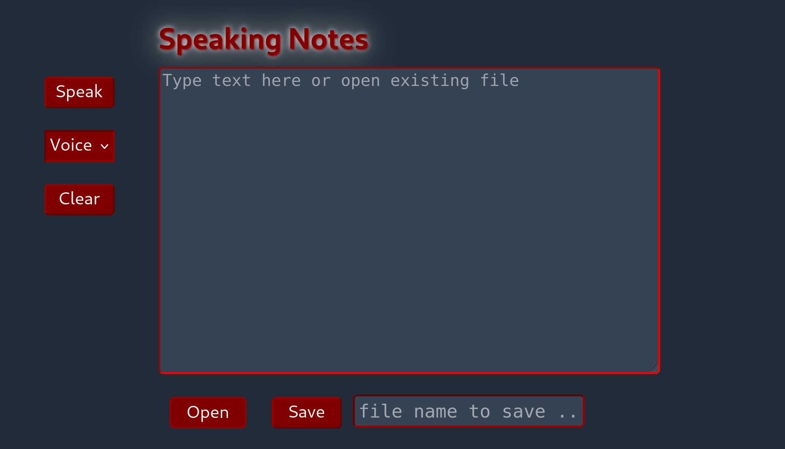

# Speaking Notes 

A lightweight and accessible notetaking-app which runs in a browser-window, uses large font-sizes and Text-To-Speech. 

It is a project for the purpose of learning only.

Build with JavaScript, React.js, uses Web-Speech-API.
___
Try it on demo-page: [Demo](https://henriettebaum.github.io/Speaking-Notes-React/)

:heavy_exclamation_mark: Note: currently the option to select a voice does not work under macOs/Safari.
___

## Changelog
- Version 2.0 uses only CSS for styling
- Version 2.1 uses **styled-components**
- Version 2.2 add function to select a voice and shows how to style the select-element.

___

## Run the app:

1. Clone the repository

2. cd into the new folder and install the required dependencies:

   `npm install`

3. Run the React project:
   
    `npm start`

___
## Sources:

[MDN Web-Speech-Api](https://developer.mozilla.org/de/docs/Web/API/SpeechSynthesis)

[Stackoverflow](https://stackoverflow.com)

[Codepen - halvves](https://codepen.io/halvves/embed/aPmxWK?height=265&theme-id=0&slug-hash=aPmxWK&default-tab=js%2Cresult&user=halvves&pen-title=React%20Hooks%20-%20useSpeechSynthesis&name=cp_embed_12)

___

